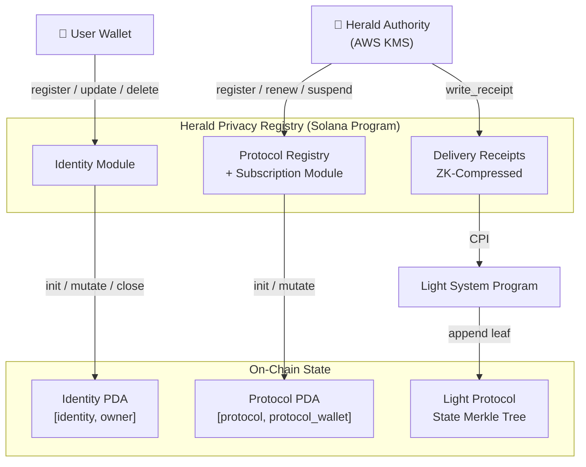
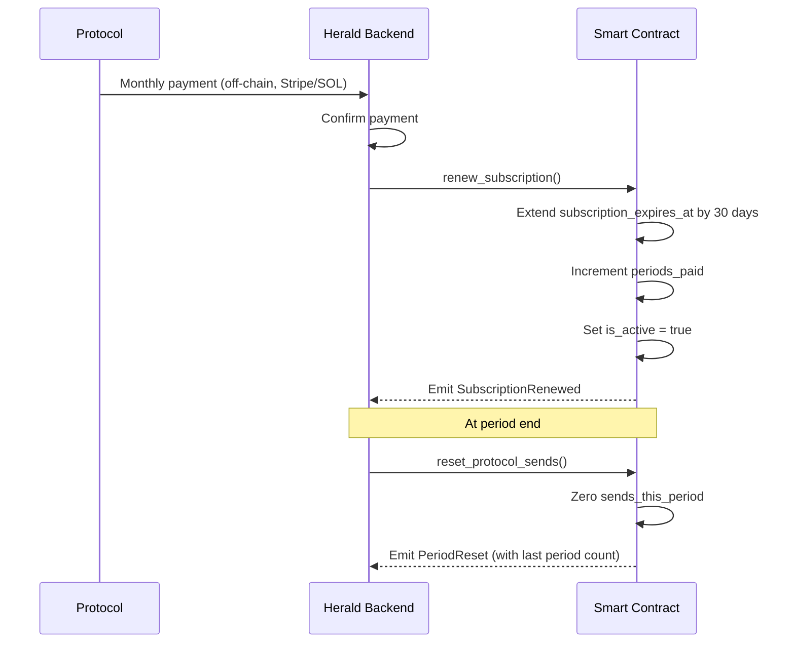
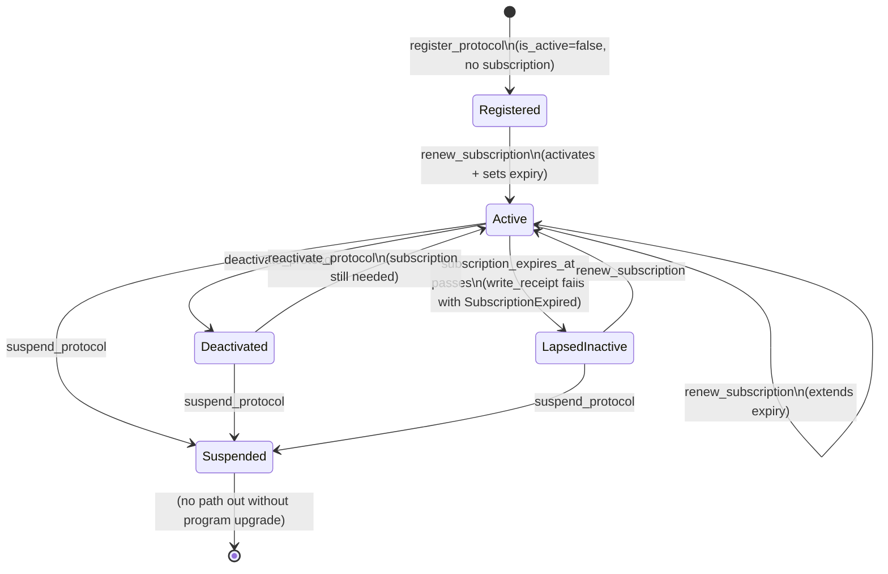
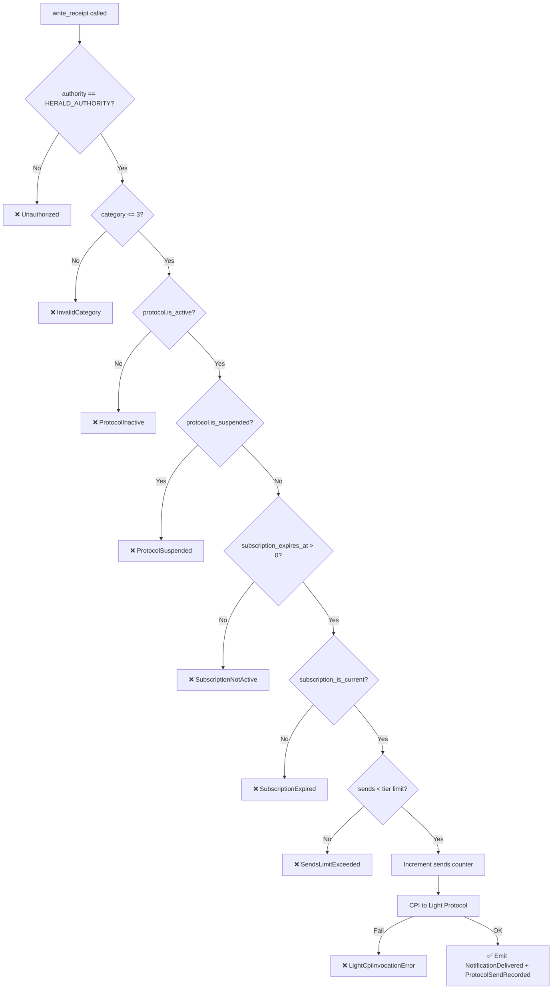

# Herald Privacy Registry

**Solana Anchor program** that stores encrypted email identities, manages DeFi protocol registrations with monthly subscriptions, and records ZK-compressed delivery receipts via [Light Protocol](https://lightprotocol.com).

> **Program ID**: `2pxjAf8tLCakKVDuN4vY51B5TeaEQk4koPuk9NZvWqdf`
> **Anchor**: 0.32.1 | **Rust**: 1.89.0 | **light-sdk**: 0.23.0

---

## 📖 Table of Contents

- [Overview](#overview)
- [Architecture](#architecture)
- [Account Model](#account-model)
- [Instructions](#instructions)
- [Subscription Billing](#subscription-billing)
- [Error Codes](#error-codes)
- [Events](#events)
- [Transaction Flows](#transaction-flows)
- [Security Model](#security-model)
- [Getting Started](#getting-started)
- [Testing](#testing)
- [Deployment](#deployment)

---

## 🌟 Overview

Herald is a privacy-first notification layer for **Solana DeFi**. Protocols pay a monthly subscription to send on-chain-provable notifications (liquidation warnings, governance votes, marketing) to wallets that have opted in, with email addresses **encrypted on-chain** and fully user-controlled.

### Core Responsibilities

| Domain | What the program does |
|--------|----------------------|
| **Identity** | Stores NaCl-encrypted email + SHA-256 hash per wallet, with per-category opt-in preferences |
| **Protocols** | Registers DeFi protocols, enforces tier-based send limits, tracks subscription expiry |
| **Receipts** | Appends ZK-compressed delivery proofs to a Light Protocol Merkle tree (no rent cost) |

---

## 🏗️ Architecture



### Full Program Structure

```
programs/herald-privacy-registry/src/
├── lib.rs                     # Entrypoint (13 instructions in 3 groups)
├── constants.rs               # HERALD_AUTHORITY, TIER_SEND_LIMITS, SUBSCRIPTION_PERIOD_SECS
├── errors.rs                  # 26 typed error variants
├── events.rs                  # 14 typed events
├── state/
│   ├── identity.rs            # IdentityAccount PDA
│   ├── protocol.rs            # ProtocolRegistryAccount PDA (with billing fields)
│   ├── receipt.rs             # DeliveryReceipt (Light compressed)
│   └── vault.rs               # SubscriptionVaultAccount PDA
└── instructions/
    ├── register_identity.rs
    ├── update_identity.rs
    ├── delete_identity.rs
    ├── register_protocol.rs
    ├── deactivate_protocol.rs
    ├── reactivate_protocol.rs
    ├── suspend_protocol.rs     # Hard-suspend (ToS/fraud)
    ├── update_tier.rs          # Modify protocol tier
    ├── renew_subscription.rs   # Monthly billing (Helio fallback)
    ├── pay_subscription.rs     # Phase 2: On-chain USDC/USDT payment
    ├── withdraw_treasury.rs    # Move vault funds to treasury
    ├── reset_protocol_sends.rs # Period-end counter reset
    └── write_receipt.rs        # ZK-compressed delivery proof
```

---

## 🗂️ Account Model

### IdentityAccount (PDA: `["identity", owner]`, 1024 bytes)

| Field | Type | Description |
|-------|------|-------------|
| `owner` | `Pubkey` | Wallet owner |
| `encrypted_email` | `Vec<u8>` | NaCl ciphertext (max 200 bytes) |
| `email_hash` | `[u8; 32]` | SHA-256 of plaintext email |
| `nonce` | `[u8; 24]` | NaCl nonce |
| `registered_at` | `i64` | Registration timestamp |
| `opt_in_all` | `bool` | Global opt-in |
| `opt_in_defi` | `bool` | DeFi opt-in |
| `opt_in_governance` | `bool` | Governance opt-in |
| `opt_in_marketing` | `bool` | Marketing opt-in |
| `digest_mode` | `bool` | Daily digest vs real-time |
| `bump` | `u8` | PDA bump |

### ProtocolRegistryAccount (PDA: `["protocol", protocol_wallet]`, 256 bytes)

| Field | Type | Description |
|-------|------|-------------|
| `owner` | `Pubkey` | Protocol admin wallet |
| `name_hash` | `[u8; 32]` | SHA-256 of protocol name |
| `tier` | `u8` | 0=dev, 1=growth, 2=scale, 3=enterprise |
| `subscription_expires_at` | `i64` | Subscription expiry timestamp |
| `last_renewed_at` | `i64` | Last renewal timestamp |
| `periods_paid` | `u32` | Total billing periods paid |
| `sends_this_period` | `u64` | Sends used in current period |
| `is_active` | `bool` | Soft-active flag |
| `is_suspended` | `bool` | Hard-suspension flag |
| `lifetime_usdc_paid` | `u64` | Accumulated USDC paid (6-decimals) |
| `last_payment_mint` | `Pubkey` | Last used payment token |
| `registered_at` | `i64` | Registration timestamp |
| `bump` | `u8` | PDA bump |

### SubscriptionVaultAccount (PDA: `["vault"]`, 65 bytes)

| Field | Type | Description |
|-------|------|-------------|
| `authority` | `Pubkey` | Herald treasury multisig |
| `total_usdc_collected` | `u64` | Total USDC volume |
| `total_usdt_collected` | `u64` | Total USDT volume |
| `last_withdrawal_at` | `i64` | Last withdrawal timestamp |
| `withdrawal_count` | `u32` | Number of withdrawals |
| `bump` | `u8` | PDA bump |

### DeliveryReceipt (Light Protocol Compressed Leaf)

| Field | Type | Description |
|-------|------|-------------|
| `protocol_pubkey` | `Pubkey` | Sending protocol |
| `recipient_hash` | `[u8; 32]` | SHA-256 of recipient wallet |
| `notification_id` | `[u8; 16]` | UUID v4 |
| `timestamp` | `i64` | Delivery time |
| `delivered` | `bool` | Always `true` |
| `category` | `u8` | 0=DeFi, 1=Gov, 2=Marketing, 3=Other |

---

## 🛠️ Instructions

### Identity (User-Signed)

| Instruction | Signer | Description |
|-------------|--------|-------------|
| `register_identity` | Owner wallet | Create identity PDA |
| `update_identity` | Owner wallet | Partial update (Option fields) |
| `delete_identity` | Owner wallet | Close PDA, refund rent |

### Protocol Lifecycle (Herald Authority)

| Instruction | Description |
|-------------|-------------|
| `register_protocol` | Create protocol PDA (initially inactive, no subscription) |
| `deactivate_protocol` | Soft-deactivate |
| `reactivate_protocol` | Re-enable (non-suspended only) |
| `suspend_protocol` | Hard-suspend (ToS/fraud); blocks renewal |
| `update_protocol_tier` | Change protocol tier (0-3) |

### Subscription Billing (Herald Authority)

| Instruction | Description |
|-------------|-------------|
| `pay_subscription` | Protocol pays on-chain with USDC/USDT to renew/activate (Phase 2) |
| `renew_subscription` | Reactivate/extend by 1 period (off-chain Helio payment fallback) |
| `withdraw_treasury` | Withdraw accumulated vault USDC/USDT to Herald treasury |
| `reset_protocol_sends` | Zero the period sends counter; emits audit event |

### Receipts (Herald Authority)

| Instruction | Description |
|-------------|-------------|
| `write_receipt` | CPI into Light Protocol to append a compressed delivery proof |

---

## 💰 Subscription Billing

### Tier Limits

| Tier | Name | Monthly Price | Sends / Month |
|------|------|---------------|---------------|
| 0 | Dev | Free | 1,000 |
| 1 | Growth | $99 | 50,000 |
| 2 | Scale | $299 | 250,000 |
| 3 | Enterprise | $999 | 1,000,000 |

### Billing Flow



### Protocol State Machine



---

## 🔴 Error Codes

| Code | Name | Description |
|------|------|-------------|
| 6000 | `EmailTooLong` | Email > 200 bytes |
| 6001 | `EmailEmpty` | Empty email |
| 6002 | `InvalidEmailHash` | Hash not 32 bytes |
| 6003 | `InvalidNonce` | Nonce not 24 bytes |
| 6004 | `EmptyUpdate` | No fields to update |
| 6005 | `Unauthorized` | Wrong authority |
| 6006 | `OwnerMismatch` | Wrong identity owner |
| 6007 | `InvalidTier` | Tier not 0–3 |
| 6008 | `ProtocolInactive` | `is_active = false` |
| 6009 | `ProtocolAlreadyDeactivated` | Already inactive |
| 6010 | `ProtocolSuspended` | Hard-suspended |
| 6011 | `SubscriptionExpired` | Past `subscription_expires_at` |
| 6012 | `SubscriptionNotActive` | Never activated |
| 6013 | `SubscriptionNotActive` | Never activated |
| 6014 | `SendsLimitExceeded` | Tier quota exhausted |
| 6015 | `SendsOverflow` | u64 counter overflow |
| 6016 | `InvalidSubscriptionExpiry` | Expiry not in future |
| 6017 | `DevTierNoPayment` | Dev tier is free |
| 6018 | `UnsupportedPaymentToken` | Must be USDC or USDT |
| 6019 | `InvalidCategory` | Category not 0–3 |
| 6020 | `InvalidRecipientHash` | Hash not 32 bytes |
| 6021 | `InvalidNotificationId` | ID not 16 bytes |
| 6022 | `LightCpiAccountsError` | Light CPI account init failed |
| 6023 | `LightAccountError` | Light account attach failed |
| 6024 | `LightCpiInvocationError` | Light CPI invoke failed |
| 6025 | `Overflow` | General arithmetic overflow |
| 6026 | `ClockUnavailable` | Solana Clock sysvar error |

---

## 📡 Events

| Event | Key Fields | Emitted By |
|-------|-----------|------------|
| `IdentityRegistered` | wallet, email_hash, opt_ins, timestamp | `register_identity` |
| `IdentityUpdated` | wallet, email_changed, prefs_changed | `update_identity` |
| `PreferencesUpdated` | wallet, all opt_in_* fields | `update_identity` |
| `IdentityDeleted` | wallet, timestamp | `delete_identity` |
| `ProtocolRegistered` | protocol, name_hash, tier | `register_protocol` |
| `ProtocolDeactivated` | protocol, timestamp | `deactivate_protocol` |
| `ProtocolReactivated` | protocol, timestamp | `reactivate_protocol` |
| `ProtocolSuspended` | protocol, timestamp | `suspend_protocol` |
| `ProtocolTierUpdated` | protocol, old_tier, new_tier | `update_protocol_tier` |
| `PaymentReceived` | protocol, amount_usdc, token_mint, tier | `pay_subscription` |
| `SubscriptionRenewed` | protocol, tier, new_expiry, usdc_paid | `pay_subscription`, `renew_subscription` |
| `PeriodReset` | protocol, sends_last_period, tier | `reset_protocol_sends` |
| `NotificationDelivered` | protocol, recipient_hash, id, category, sends | `write_receipt` |
| `ProtocolSendRecorded` | protocol, sends_this_period, sends_limit | `write_receipt` |

---

## 🔄 Transaction Flows

### `write_receipt` Security Gate



---

## 🛡️ Security Model

See [docs/SECURITY.md](./docs/SECURITY.md) for the full audit report.

### Access Control Summary

| Instruction | Required Signer | Key Checks |
|-------------|----------------|------------|
| `register_identity` | Wallet owner | PDA seeded by owner |
| `update_identity` | Wallet owner | PDA seed + `owner` field match |
| `delete_identity` | Wallet owner | PDA seed + bump |
| `register_protocol` | `HERALD_AUTHORITY` | Compile-time constant |
| `deactivate_protocol` | `HERALD_AUTHORITY` | + must be active |
| `reactivate_protocol` | `HERALD_AUTHORITY` | + must be inactive & not suspended |
| `suspend_protocol` | `HERALD_AUTHORITY` | |
| `update_protocol_tier` | `HERALD_AUTHORITY` | |
| `pay_subscription` | Protocol admin | Validates mint, payer is `protocol.owner` |
| `renew_subscription` | `HERALD_AUTHORITY` | + must not be suspended |
| `withdraw_treasury` | `HERALD_AUTHORITY` | Vault PDA acts as signer for transfer |
| `reset_protocol_sends` | `HERALD_AUTHORITY` | |
| `write_receipt` | `HERALD_AUTHORITY` | + active + not suspended + subscription current + within limit |

---

## 🚀 Getting Started

### Prerequisites

```bash
# Check installations
rustup show           # 1.89.0
solana --version      # 1.18+
anchor --version      # 0.32.1
node --version        # 18+
```

### Build & Test

```bash
yarn install
anchor build
anchor test
```

---

## 🧪 Testing

```bash
anchor test   # Runs full suite on localnet
```

Full integration tests for ZK receipts require the Light Protocol test validator:
```bash
npx @lightprotocol/zk-compression-cli start-test-validator
```

---

## 🌐 Deployment

```bash
# Deploy to devnet
anchor deploy --provider.cluster devnet

# Set upgrade authority to multisig (production)
solana program set-upgrade-authority <PROGRAM_ID> --new-upgrade-authority <MULTISIG>
```

Post-deployment:
1. Replace `HERALD_AUTHORITY` placeholder with actual KMS pubkey and redeploy
2. Initialise Light Protocol Merkle trees
3. Register protocols via `register_protocol`
4. Activate via `renew_subscription` after first payment

---

## 📜 License

ISC
