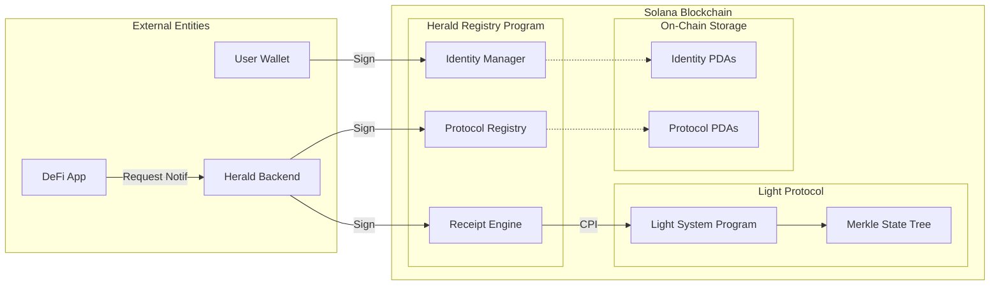
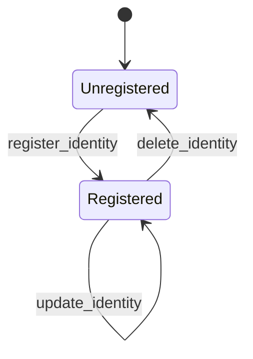
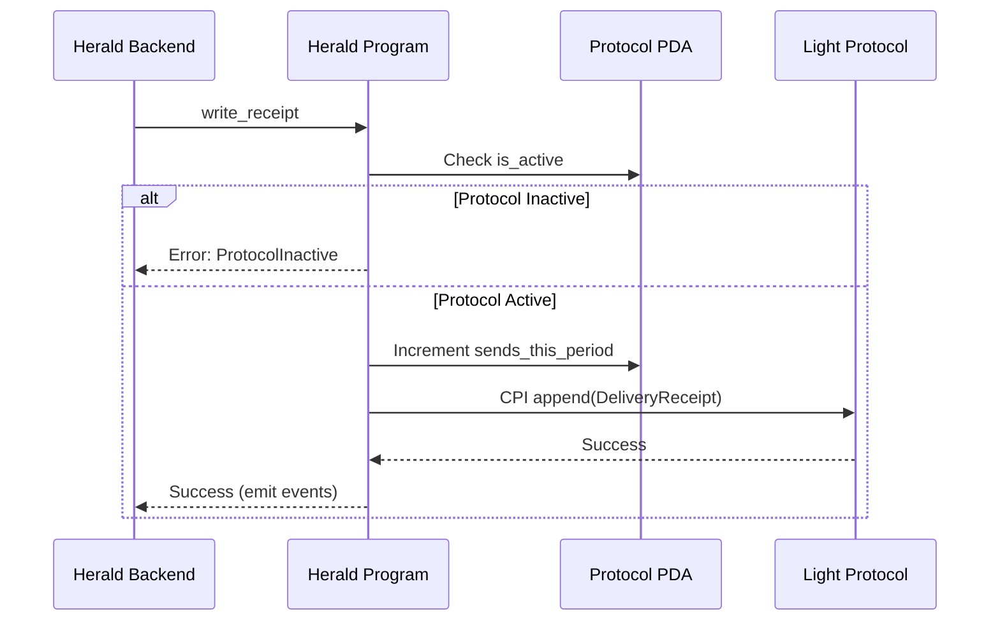

# Architecture Documentation: Herald Privacy Registry

This document provides a deep dive into the architecture, data models, and logical flows of the Herald Privacy Registry.

## 🏛️ System Architecture

Herald is built as a modular Solana program using the Anchor framework. It integrates with Light Protocol for zero-knowledge state compression.

## 💾 State Management

### 1. Identity State (PDA)
Stored in standard Solana accounts.
- **Purpose**: Low-latency lookup of user preferences and encrypted endpoints.
- **Ownership**: Owned by the user wallet.

### 2. Protocol State (PDA)
Stored in standard Solana accounts.
- **Purpose**: Identity validation for protocols and billing/usage tracking.

### 3. Delivery Receipts (Compressed)
Stored in Light Protocol's Merkle tree.
- **Purpose**: Proof of delivery without the high cost of standard account rent.

## 🔄 Logical Flows

### Identity Lifecycle

### Protocol Usage Flow

## 🔐 Security Principles

1. **Cryptographic Privacy**: Email addresses are encrypted using NaCl (Box) before reaching the program.
2. **Authority Constraints**: 
   - Identity: `signer == identity_account.owner`
   - Registry: `signer == HERALD_AUTHORITY`
3. **ZK-Compression**: Ensures delivery receipts are verifiable without exposing full state history to cheap tampering.

## 🛠️ Implementation Details

### Instruction Logic Summary

- **`register_identity`**: Validates length, initializes PDA, sets default preferences.
- **`update_identity`**: Uses `Option<T>` for surgical updates, tracking changes to emit specialized events (`PreferencesUpdated`).
- **`delete_identity`**: Standard `close` logic with rent reclamation.
- **`register_protocol`**: Authority-only, initializes protocol metadata.
- **`write_receipt`**: Encapsulates Light Protocol CPI logic, manages protocol usage counters.

### Event System

High-fidelity event emission allows the Herald Backend to sync state efficiently:
- `IdentityRegistered` / `IdentityUpdated` / `IdentityDeleted`
- `PreferencesUpdated`: Specialized for configuration changes.
- `ProtocolRegistered` / `ProtocolSendRecorded`
- `NotificationDelivered`: Records the category for analytics.
