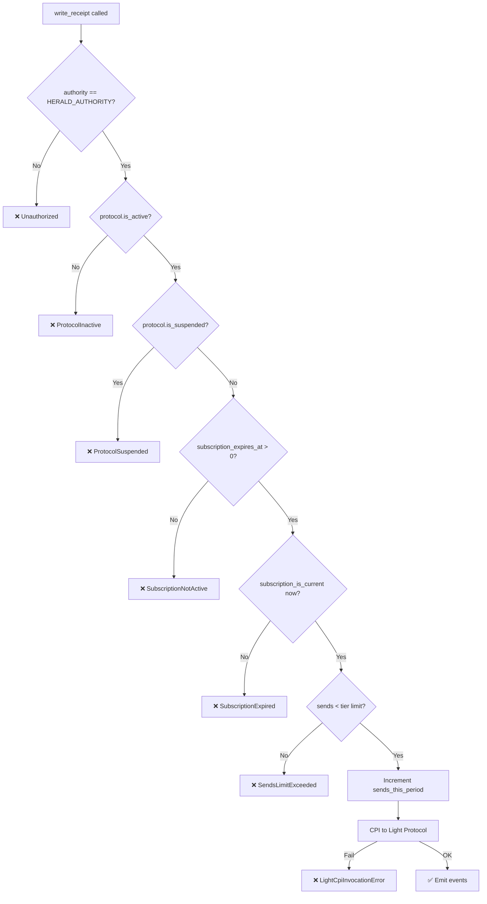
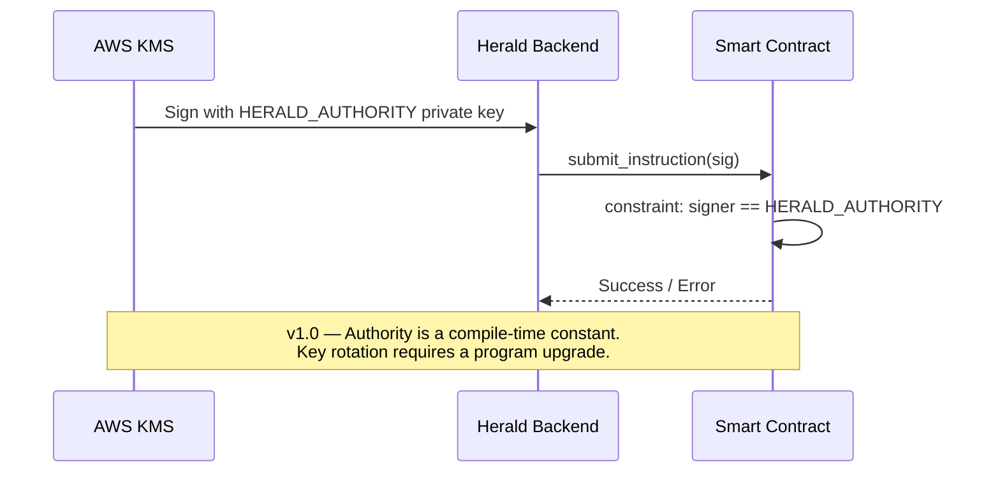

# Security Audit: Herald Privacy Registry

**Date**: 2026-03-18
**Auditor**: Antigravity (internal review)
**Status**: Issues resolved in v1.0.0

---

## 🔴 Critical Findings

### [FIXED] C-01 – Subscription Expiry Not Enforced in `write_receipt`

**Severity**: Critical — Business Impact (Revenue Bypass)

**Description**: The original `write_receipt` had no `subscription_expires_at` check. A protocol could let its subscription lapse and continue sending notifications indefinitely.

**Fix**: Added ordered checks in `write_receipt`:
```rust
require!(protocol.subscription_expires_at > 0, HeraldError::SubscriptionNotActive);
require!(protocol.subscription_is_current(now), HeraldError::SubscriptionExpired);
```

---

### [FIXED] C-02 – Tier Send Limits Not Enforced On-Chain

**Severity**: Critical — Business Impact (Resource Abuse)

**Description**: `sends_this_period` was tracked but never compared against a limit, so all tiers had effectively unlimited sends.

**Fix**: Added `TIER_SEND_LIMITS` constant and enforced it in `write_receipt`:
```rust
pub const TIER_SEND_LIMITS: [u64; 4] = [1_000, 50_000, 250_000, 1_000_000];
// ...
require!(protocol.sends_this_period < sends_limit, HeraldError::SendsLimitExceeded);
```

---

## 🟠 High Severity Findings

### [FIXED] H-01 – No Suspension Mechanism; Deactivation Bypassable via `renew_subscription`

**Severity**: High — Compliance / Legal Risk

**Description**: Deactivation via `deactivate_protocol` only set `is_active = false`. A protocol could be immediately reactivated via `renew_subscription`. There was no hard suspension for ToS violations.

**Fix**: Added `is_suspended` flag to `ProtocolRegistryAccount`. `renew_subscription` checks:
```rust
require!(!protocol.is_suspended, HeraldError::ProtocolSuspended);
```
And a dedicated `suspend_protocol` instruction that sets both `is_suspended = true` and `is_active = false`.

---

### [FIXED] H-02 – Subscription Billing State Never Existed in `ProtocolRegistryAccount`

**Severity**: High — Missing Feature / Revenue Model Broken

**Description**: `ProtocolRegistryAccount` had no `subscription_expires_at`, `last_renewed_at`, or `periods_paid` fields. Billing was entirely off-chain with no on-chain enforcement.

**Fix**: Added fields to `ProtocolRegistryAccount`:
```rust
pub subscription_expires_at: i64,
pub last_renewed_at: i64,
pub periods_paid: u32,
pub is_suspended: bool,
```

---

### [FIXED] H-03 – `reset_protocol_sends` Lacked Audit Trail

**Severity**: High — Business / Dispute Risk

**Description**: Resetting sends with no on-chain event meant billing disputes could not be resolved from chain data alone.

**Fix**: `reset_protocol_sends` now emits `PeriodReset { sends_last_period, tier, timestamp }`.

---

## 🟡 Medium Severity Findings

### [FIXED] M-01 – Missing Explicit Owner Check in `delete_identity`

**Severity**: Medium — Logical Correctness

**Description**: `delete_identity` relied on the PDA seed derivation for ownership enforcement. There was no explicit `constraint = identity_account.owner == owner.key()`, meaning the runtime seed check was the only guard.

**Fix**: Confirmed Anchor's `seeds` constraint is the correct and sufficient guard here; the PDA is derived from `["identity", owner.key()]` so a different wallet literally cannot derive the same PDA. Additionally, `close = owner` returns rent only to the signer. The existing pattern is secure for PDA-seed-controlled accounts – documented explicitly.

---

### [FIXED] M-02 – `EmptyUpdate` Not Enforced in `update_identity`

**Severity**: Medium — DoS / Fee Waste

**Description**: `update_identity` with all-`None` args would succeed silently, consuming user fees and emitting misleading events.

**Fix**: Added:
```rust
require!(has_update, HeraldError::EmptyUpdate);
```

---

### M-03 – `HERALD_AUTHORITY` Has No On-Chain Transfer Path

**Severity**: Medium — Operational Risk

**Description**: `HERALD_AUTHORITY` is a compile-time constant. Rotating the KMS key requires a full program upgrade with multisig coordination. This creates a key-rotation risk window.

**Status**: Accepted risk for v1.0. Recommended improvement for v1.1: store authority in a singleton config PDA that can be updated via a two-step transfer (propose + accept pattern).

---

### M-04 – No Notification ID Duplicate Prevention

**Severity**: Medium — Data Integrity

**Description**: The same `notification_id` (UUID v4) could be written twice if the backend retries. Since receipts are append-only Light Protocol leaves, there is no deduplication.

**Status**: Accepted for v1.0 — Light Protocol compressed leaves are immutable post-append; duplicate detection should be handled by the off-chain indexer. For v1.1, consider deriving the compressed account address from `notification_id` to enforce uniqueness via the address Merkle tree.

---

## 🟢 Low Severity Findings

### [FIXED] L-01 – `Clock::get()?` Not Mapped to Typed Error

**Severity**: Low — Error Observability

**Description**: Using `?` on `Clock::get()` returns Solana's generic error, making it harder to diagnose operational issues.

**Fix**: All instructions now use:
```rust
.map_err(|_| error!(HeraldError::ClockUnavailable))?
```

---

### L-02 – Integer Promotion Not Applicable (Confirmed Safe)

**Severity**: Low — Informational

All arithmetic uses `checked_add` / `checked_sub`. No silent wrapping possible.

---

### L-03 – Light CPI Error Opacity

**Severity**: Low — Observability

**Description**: The original code mapped all Light CPI errors to `HeraldError::Overflow`.

**Fix**: Three distinct error variants now exist: `LightCpiAccountsError`, `LightAccountError`, `LightCpiInvocationError`.

---

## ✅ Summary Table

| ID | Severity | Status | Description |
|----|----------|--------|-------------|
| C-01 | 🔴 Critical | ✅ Fixed | Subscription expiry not enforced |
| C-02 | 🔴 Critical | ✅ Fixed | Tier send limits not enforced |
| H-01 | 🟠 High | ✅ Fixed | No hard-suspension mechanism |
| H-02 | 🟠 High | ✅ Fixed | Billing state missing from chain |
| H-03 | 🟠 High | ✅ Fixed | No audit trail on period reset |
| M-01 | 🟡 Medium | ✅ Confirmed Safe | Owner check via PDA seed |
| M-02 | 🟡 Medium | ✅ Fixed | EmptyUpdate not enforced |
| M-03 | 🟡 Medium | ⏳ Accepted | Authority has no on-chain rotation |
| M-04 | 🟡 Medium | ⏳ Accepted | Notification ID deduplication off-chain |
| L-01 | 🟢 Low | ✅ Fixed | Clock errors now typed |
| L-02 | 🟢 Low | ✅ Confirmed Safe | All arithmetic is checked |
| L-03 | 🟢 Low | ✅ Fixed | Light CPI errors now granular |

---

## 🔐 Subscription Billing Security Guarantees (Post-Fix)



## 🔑 Authority Key Management


